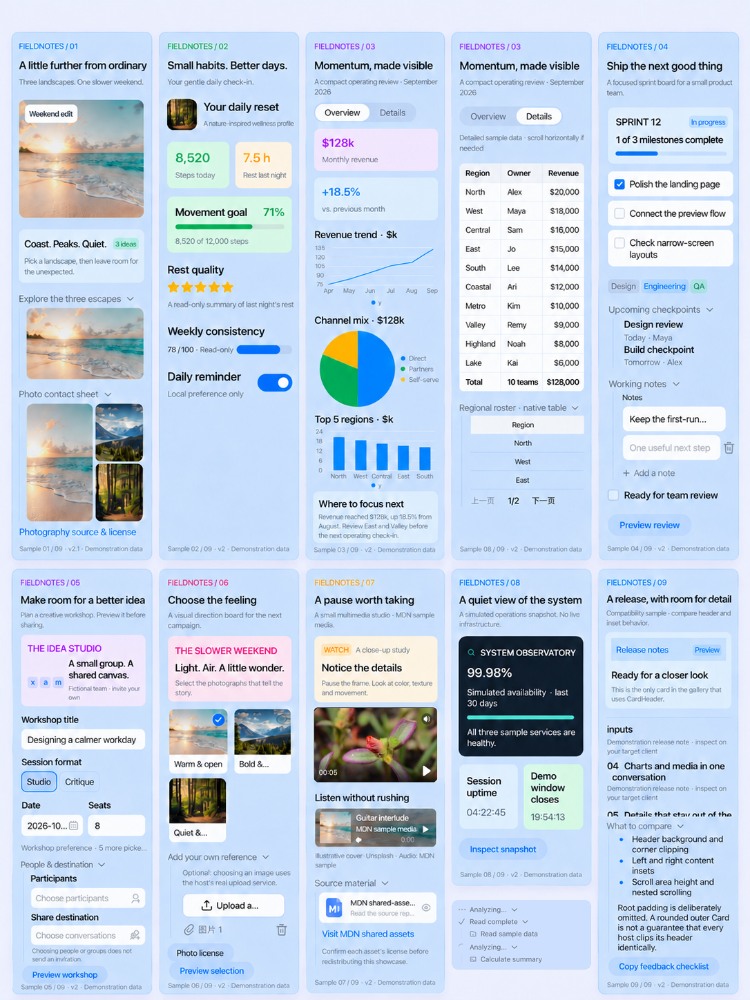
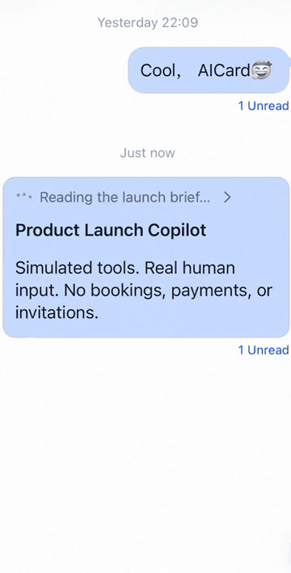
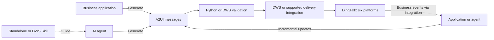

<div align="center">

# DingTalk AI Card

**Turn business data and AI agent output into interactive cards in DingTalk.**

An A2UI-based interface layer for business applications and AI agents. Compose interactive cards with declarative JSON and bring them to DingTalk across six platforms.

[](#compatibility)

[](LICENSE)
[](spec/README.md)
[](skills/dingtalk-aicard/SKILL.md)
[](#dws-commands)

[Gallery](#component-gallery) · [Capabilities](#components-and-interaction-capabilities) · [Quick start](#quick-start) · [Integration paths](#choose-your-integration) · [Reference](#developer-reference) · [Contributing](CONTRIBUTING.md)

</div>

Generate A2UI directly from your application, or use a Skill to assist an agent. Query contracts and validate files with the standalone Python tools or native DWS commands; use DWS to preview, send, and update cards.

## Component gallery



A showcase assembled from real DingTalk client screenshots. These examples illustrate the component system, not a fixed set of templates or business scenarios. [Watch component interactions](assets/showcase/component-interactions.mp4).

**47 components · 40 functions** for layouts, content, inputs, expressions, and interactions. [Explore the capabilities](#components-and-interaction-capabilities).

## Showcase

### Live execution and interactive details

<p align="center">
  
  &nbsp;
  
</p>

### Human-in-the-loop workflow

<p align="center">
  
</p>

Collect user input, lock submitted controls, and let your application or agent continue the workflow.

<details>
<summary>Watch full recordings</summary>

- [Live execution](assets/showcase/agent-loading.mp4)
- [Expand and collapse](assets/showcase/agent-expand-collapse.mp4)
- [End-to-end report](assets/showcase/agent-execution.mp4)
- [Human-in-the-loop workflow](assets/showcase/human-in-the-loop.mp4)
- [Component interactions](assets/showcase/component-interactions.mp4)

The recordings use sample data and simulated tasks. GIFs are edited for pace and play independently; videos are cropped and muted.

</details>

## Choose your integration

| Path | Best for | How it works |
| --- | --- | --- |
| **Business application** | Existing services, templates, and business workflows | Generate A2UI in code, validate it, and deliver through a supported DingTalk integration or DWS. No Skill required. |
| **Standalone Skill** | Adding card authoring to your own agent | Install the Skill; the agent uses bundled guidance, protocol references, and Python lookup and validation tools. DWS is optional. |
| **DWS integration** | Native CLI tooling and DingTalk delivery | Call DWS directly from a program or terminal, or let an agent use the DWS-adapted Skill. No Python required. |

The two Skills share authoring guidance and protocol references, but use different execution tools. A Skill guides the agent; it is not a generation service. DWS commands work without a Skill, and copying a Skill does not add native commands to an older DWS binary.

## Quick start

### 1. Start with an A2UI file

An A2UI file is an ordered array of messages describing a Surface, its data, and its components. Start with a complete [report](spec/examples/data-report.json) or [form](spec/examples/form-interaction.json), then replace demonstration data with your own.

Generate the file in application code, write it directly, or [ask an agent to author it](#generate-with-a-skill). Initialize a new card explicitly; send only intended changes when updating an existing card. See the [Surface lifecycle](spec/README.md#surface-initialization-and-updates).

### 2. Prepare the local validator

Download or clone this repository into a writable directory outside `/tmp` and `/private/tmp`, then open a terminal at the repository root. Use Python 3.10+ with `venv` and `ensurepip` available:

```bash
python3 skills/dingtalk-aicard/scripts/setup_env.py
```

The script creates or reuses `.aicard-venv` in the current directory and runs a self-check. Continue only when it exits successfully and reports `ready: true`. Initial setup may download dependencies; subsequent lookup and validation are offline. No DWS installation or DingTalk login is required.

### 3. Inspect and validate an example

Use the returned `pythonExecutable` for the commands below. With the default environment location, the POSIX-shell commands are:

```bash
.aicard-venv/bin/python skills/dingtalk-aicard/scripts/aicard_lint.py --explain Table --format json
.aicard-venv/bin/python skills/dingtalk-aicard/scripts/aicard_lint.py spec/examples/data-report.json --preflight new-card --format json
```

On Windows, use `.aicard-venv\\Scripts\\python.exe` instead. If you selected a custom environment with `--venv`, use its returned interpreter path.

A passing new-card check exits with code 0 and includes these fields:

```json
{
  "valid": true,
  "preflight": {
    "valid": true,
    "diagnostics": []
  },
  "renderingVerified": false
}
```

This is an excerpt, not the complete report. Review any diagnostics. You now have a locally validated example; replace the example path with your own A2UI file to repeat the check. Validation does not send a card.

### Optional: use native DWS AICard commands

The native `dws aicard explain`, `lint`, and `preview` commands require a DWS build containing this repository's AICard module. A public release with these commands is not currently established by this guide; installing the public CLI alone is not sufficient assurance. Check `dws aicard --help` for all three commands.

If they are unavailable, continue with the Python path above. Developers integrating the native module can follow [the source-build instructions](CONTRIBUTING.md#native-dws-build). Installing or copying the DWS Skill alone does not install the native commands.

With a compatible build:

```bash
dws aicard explain Table --format json
dws aicard lint --file spec/examples/data-report.json --preflight new-card --format json
dws aicard preview --file spec/examples/data-report.json --dry-run --format json
```

Native lookup and validation need neither Python nor a signed-in Profile. DWS wraps successful validation results in `data`: check `data.valid` and `data.preflight.valid`. Preview with `--dry-run` stays local.

### Optional: deliver a card

Delivery is separate from the offline quick start. Use [DingTalk Workspace CLI](https://github.com/DingTalk-Real-AI/dingtalk-workspace-cli) or your supported delivery integration. Follow its authentication instructions, select the intended organization and account, and resolve the target before sending.

DWS's general chat commands are separate from the native AICard module: inspect `dws chat message send-a2ui-card --help` and `dws chat message update-a2ui-card --help` in your installed CLI. Their availability does not imply that `dws aicard` is installed.

With the native module, `dws aicard preview --file spec/examples/data-report.json --format json` sends a real self-preview. Use native `lint --emit` when serialized messages are needed; JSON-encode `data.a2uiMessages` as the sending command's `--content` argument. Without the module, serialize each validated A2UI message to a string and JSON-encode the resulting string array using a program.

Preserve the server-returned `bizId` and the original `surfaceId` for updates. Complete a static native preview through an update using `--flow-status FINISH` and a nonempty, state-preserving delta; do not replay creation or reset form values. See the [DWS delivery guidance](dws-aicard/skills/multi/dingtalk-aicard/SKILL.md#delivery-boundary).

### Generate with a Skill

**Standalone:** copy the complete [skills/dingtalk-aicard/](skills/dingtalk-aicard/) directory into your agent's supported skills directory. Keep references, scripts, and license files together. Follow its Python setup instructions; the repository root and DWS are not required after installation.

**DWS:** use the [DWS-adapted Skill](dws-aicard/skills/multi/dingtalk-aicard/SKILL.md) with a compatible DWS build. It guides the agent through native lookup, validation, and requested delivery rather than invoking Python scripts.

For example:

> Create an A2UI expense-review card with a summary, an itemized table, and an editable reviewer note. Use labeled sample data, leave unspecified business actions unconnected, and validate the file. Do not send it.

## DWS commands

The native `dws aicard` rows require the compatible build described above. The `dws chat message` rows belong to the separate chat delivery API; check availability in your installed CLI.

| Task | Command | Result |
| --- | --- | --- |
| Inspect contracts | `dws aicard explain <name>` | Component, function, common-type, or Token definitions; supports batch lookup |
| Validate JSON | `dws aicard lint --file <file>` | Schema validation and field-level diagnostics |
| Check new-card structure | `lint --preflight new-card` | Initialization, root, static references, and cycle checks |
| Check inline resources | `lint --preflight resources` | Resource-encoding checks without requiring a complete new card |
| Serialize for delivery | `lint --emit` | Validated messages as a string array in `data.a2uiMessages` |
| Preview to yourself | `dws aicard preview --file <file>` | A real self-preview; `--dry-run` stays local |
| Send to a target | `dws chat message send-a2ui-card` | Create and send to the selected person or conversation |
| Update a card | `dws chat message update-a2ui-card` | Update the original card using its server-issued `bizId` |

The `lint` rows abbreviate `dws aicard lint --file <file>` plus the listed option. See command help for fragment validation, package self-checks, compact queries, and delivery parameters. Lookup and validation are local; actual preview, sending, and updating require authentication and service access.

### Validation and diagnostics

Both tool paths check syntax and protocol constraints, including fields, required values, types, and enumerations. Diagnostics identify the failing field so a developer or agent can repair the original payload.

New-card preflight additionally checks initialization and the final static component snapshot; resource preflight checks inline encoding. Check the selected preflight result as well as Schema validity. These checks do not evaluate bindings or functions, certify every streaming frame, load remote media, or prove client rendering and callbacks. Verify actual behavior in the target client.

## Components and interaction capabilities

The current V0.8 protocol defines **47 components** and **40 functions**: 14 core functions, 18 expression functions, 7 DingTalk host actions, and the system function `@index` defined in the common types. These counts describe protocol definitions, not the number of examples.

| Capability | Included examples |
| --- | --- |
| Layout and composition | `Row`, `Column`, `GridLayout`, `Stack`, `Tabs`, `CollapsiblePanel`, `Loop` |
| Content and data | `Text`, `Markdown`, `Table`, `Chart`, `File`, `ProgressBar` |
| Inputs and selection | `TextField`, `NumberInput`, `ChoicePicker`, `DateTimeInput`, `UserPicker`, `ImageUpload` |
| Media | `Image`, `ImageCarousel`, `Video`, `AudioPlayer` |
| Expressions | Arithmetic (`add`, `mul`), comparison (`eq`, `gt`), conditionals (`cond`), array and object access (`arrayGet`, `objectGet`) |
| Functions | Formatting (`formatDate`, `formatNumber`), validation (`required`, `regex`), logic (`and`, `or`, `not`) |
| Host actions | `copyText`, `openChat`, `previewImages`, `previewVideo`, `promptText`, `showConfirm`, `showModal` |
| Events and callbacks | `action.event` for named application events; `action.functionCall` for renderer-side functions; component-specific slots such as `onTap`, `onComplete`, and `onPreview` |
| Data and updates | Path bindings, data-driven lists, `updateDataModel`, and `updateComponents` |

<details>
<summary>View all 47 component names</summary>

- **Common components:** `Button`, `Card`, `Column`, `Divider`, `Icon`, `Image`, `Markdown`, `Row`, `Tag`, `Text`.
- **Composition:** `ButtonGroup`, `CardHeader`, `CollapsiblePanel`, `ColumnLayout`, `GridLayout`, `Link`, `List`, `Loop`, `ScrollView`, `Stack`, `Tabs`.
- **Inputs:** `CheckBox`, `CheckableImageList`, `CheckboxListMulti`, `ChoicePicker`, `ConversationPicker`, `DateTimeInput`, `ImageUpload`, `InputList`, `NumberInput`, `Rating`, `Slider`, `Switch`, `TextField`, `UserPicker`.
- **Data and media:** `AudioPlayer`, `Avatar`, `AvatarGroup`, `Chart`, `Countdown`, `ElapsedTime`, `File`, `ImageCarousel`, `ImageList`, `ProgressBar`, `Table`, `Video`.

</details>

Browse the [component contracts](skills/dingtalk-aicard/references/index/components.md), [function contracts](skills/dingtalk-aicard/references/index/functions.md), and [action schema](spec/common-types-basic.json). Event slots and function placement are defined per component; the table does not imply every action is accepted in every slot.

## How it fits together



The application or agent produces A2UI; the tools inspect and validate it; the delivery integration sends it; DingTalk renders the card and handles client interactions. Your integration handles business events and subsequent updates. This repository does not bundle client renderer source or an automatic business orchestration service.

For live execution, send successive complete message batches as work progresses. Submitting an entire recorded sequence at once may expose only the final state. See [execution and replay guidance](skills/dingtalk-aicard/references/patterns/progress.md#examples-and-replay).

## Developer reference

| Resource | What to find |
| --- | --- |
| [Specification](spec/README.md) | Messages, data binding, expressions, lifecycle, and compatibility |
| [Components](skills/dingtalk-aicard/references/index/components.md) | Layouts, display, input, and interaction components |
| [Functions](skills/dingtalk-aicard/references/index/functions.md) | Function contracts and host actions |
| [Visual Tokens](skills/dingtalk-aicard/references/index/tokens.md) | Colors, typography, and icon references |
| [Form and event example](spec/examples/form-interaction.json) · [Host actions](spec/examples/host-action.json) | Input bindings and interaction message shapes |
| [Scenario examples](spec/examples/README.md) | Complete A2UI examples to adapt |
| [Standalone Skill](skills/dingtalk-aicard/SKILL.md) · [DWS Skill](dws-aicard/skills/multi/dingtalk-aicard/SKILL.md) | Authoring workflows and execution-specific instructions |
| [DWS build and integration](CONTRIBUTING.md#native-dws-build) | Native module integration and reproducible builds |

README media lives in [assets/showcase/](assets/showcase/), separate from protocol examples and installed Skills.

## Compatibility

DingTalk AI Card's published components, functions, expressions, events, and visual effects are supported across **iOS, Android, HarmonyOS, Windows, macOS, and Web**, including shimmer and generation indicators. Layout adapts to each platform's screen size and host interface.

V0.8 is the DingTalk specification release; message `version` remains `"v1.0"`. The specification is based on **A2UI 1.0 with DingTalk extensions and a supported subset**, not a drop-in implementation for every A2UI renderer. See [compatibility and terms](spec/README.md#compatibility-with-a2ui-10).

## Contributing and security

See [CONTRIBUTING.md](CONTRIBUTING.md) for source ownership, builds, and tests. For rendering issues, include the client platform/version, a minimal sanitized payload, and expected versus observed behavior. Never post credentials or private user data. Report vulnerabilities through the private channels in [SECURITY.md](SECURITY.md).

## License

[Apache-2.0](LICENSE). See [NOTICE](NOTICE) for attribution and scope, and [spec/NOTICE](spec/NOTICE) for protocol provenance. Both Skill distributions include license and notice files for redistribution.
